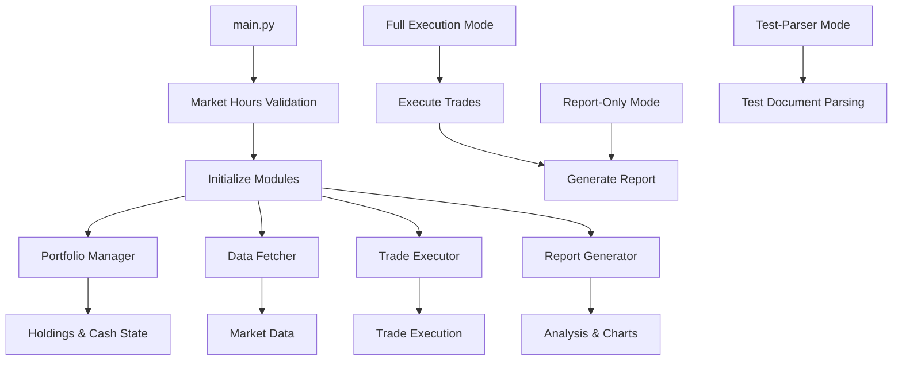

# LLM Managed Portfolio - Fully Modular Architecture

The original `Daily_Portfolio_Script.py` has been **completely broken down** into a fully modular system located in `Pieced Portfolio Scripts/`. Each module handles a specific domain and can be managed independently.

## 🏗️ Complete Modular Architecture

### Core System Modules

1. **`portfolio_manager.py`** (239 lines) - Portfolio State Management
   - Holdings and cash management
   - State persistence (JSON save/load)
   - Position updates and cleanup
   - Partial fill mode configuration
   - Cash flow operations

2. **`data_fetcher.py`** (310 lines) - Market Data Operations  
   - yfinance integration and error handling
   - Current price fetching with fallbacks
   - Historical data retrieval
   - Benchmark calculations
   - Volume alerts and data quality checks

3. **`trade_executor.py`** (673 lines) - Trading Operations
   - Document parsing (PDF/Markdown)
   - Order validation and cash flow analysis
   - Trade execution with partial fill handling
   - Trade logging and result tracking
   - Portfolio holdings updates

4. **`report_generator.py`** (487 lines) - Analysis & Reporting
   - Position metrics calculations
   - Performance validation integration
   - Alert generation (price, volume, weight drift)
   - Chart generation (performance, position details)
   - Historical data export and analysis files

### Supporting Modules

5. **`trading_models.py`** - Data Structures
   - `OrderType`, `OrderPriority`, `PartialFillMode` enums
   - `TradeOrder` and `TradeResult` dataclasses
   - Type definitions and validation

6. **`market_hours.py`** - Market Hours Validation
   - NYSE/NASDAQ open status checking
   - Timezone-aware validation
   - Holiday calendar integration

7. **`performance_validator.py`** - Performance Validation
   - Multi-method validation system
   - Cross-validation and consensus
   - State file and trade log reconciliation

8. **`utils.py`** - Utility Functions
   - Chart generation helpers
   - Currency/percentage formatting
   - Date calculations

9. **`main.py`** (142 lines) - **System Orchestrator**
   - Coordinates all modules
   - Provides clean CLI interface
   - Handles workflow orchestration

## 🔄 Complete Code Flow



### Execution Flow Details

#### 1. **System Initialization** (`main.py`)
```python
portfolio_system = LLMManagedPortfolio()
├── PortfolioManager() - Load holdings, cash, configuration
├── DataFetcher() - Initialize market data handlers  
├── TradeExecutor() - Set up trade logging and document parsing
└── ReportGenerator() - Connect to other modules for reporting
```

#### 2. **Trading Workflow** (Full Mode)
```python
execute_automated_trading():
├── find_trading_document() - Auto-detect recommendation files
├── parse_document() - Extract orders from PDF/Markdown
├── validate_cash_flow() - Check if trades are feasible
├── execute_orders() - Process trades with cash management
├── _update_portfolio_holdings() - Update positions and save state
└── generate_report() - Create comprehensive analysis
```

#### 3. **Report Generation Workflow** (Report Mode)
```python
generate_report():
├── fetch_current_data() - Get latest market prices
├── calculate_position_metrics() - Analyze all positions
├── validate_performance() - Multi-method validation
├── check_alerts() - Generate price/volume/weight alerts
├── export_historical_performance() - Update CSV tracking
├── generate_analysis_file() - Create markdown analysis
├── plot_performance_chart() - Generate time series charts
└── plot_position_details() - Create position breakdown charts
```

## 🚀 Usage

### Current Implementation (Fully Modular)
```bash
cd "Pieced Portfolio Scripts"

# Full execution (trading + reporting)
conda run -n trading_env python main.py

# Report generation only
conda run -n trading_env python main.py --report-only

# Test document parsing
conda run -n trading_env python main.py --test-parser
```

### Legacy Implementation (Deprecated)
```bash
# ⚠️ LEGACY - Use modular version instead
conda run -n options python Daily_Portfolio_Script.py
```

## 📦 Environment Setup

### Required Environment
- **Environment Name**: `trading_env` (new) or `options` (legacy)
- **Python Version**: 3.11+
- **Key Dependencies**: yfinance, matplotlib, pandas, numpy, pandas-market-calendars, pytz

### Installation
```bash
# Create new environment with all dependencies
conda create -n trading_env python=3.11 yfinance matplotlib pandas numpy pandas-market-calendars pytz -c conda-forge -y

# Or use existing environment
conda activate options  # or trading_env
```

## 🔧 Advanced Configuration

### Partial Fill Modes
```python
portfolio.set_partial_fill_mode(
    PartialFillMode.SMART,    # AUTOMATIC, ASK_CONFIRMATION, REJECT, SMART
    min_cash_reserve=50.00,   # Minimum cash to maintain
    threshold=0.8             # 80% affordability threshold for SMART mode
)
```

### Document Search Patterns
The system automatically searches for trading documents:
- `trading_recommendation*.md`
- `trading_recommendation*.pdf`
- `trading_recommendations*.md` 
- `trading_recommendations*.pdf`
- `claude_recommendation*.md`
- `claude_recommendation*.pdf`
- `portfolio_analysis*.md`
- `portfolio_analysis*.pdf`

## 📊 Output Files Generated

### Data Files
- `portfolio_state.json` - Current portfolio state
- `portfolio_performance_history.csv` - Historical tracking
- `trade_execution.log` - Trade execution log
- `daily_portfolio_analysis.md` - Analysis for Claude

### Chart Files
- `LLM Managed Portfolio Performance.png` - Time series performance
- `Portfolio Position Details.png` - Position breakdown charts

## 🔄 Migration from Legacy System

### What Changed
- **Complete modularization** - All ~3,000 lines broken into focused modules
- **Enhanced error handling** - Better yfinance integration and fallbacks
- **Improved validation** - Multi-method performance validation
- **Better documentation** - Each module is self-documented
- **Cleaner interfaces** - Clear separation of concerns

### Compatibility
- **State files compatible** - Existing `portfolio_state.json` works
- **Data format unchanged** - Historical CSV format preserved  
- **Same CLI arguments** - `--report-only` flag works identically
- **Output files identical** - Charts and analysis files unchanged

## 💡 Benefits of Modular Architecture

### For Development
1. **Maintainability** - Changes isolated to relevant modules
2. **Debuggability** - Issues can be traced to specific modules
3. **Testability** - Individual modules can be unit tested
4. **Readability** - Each module has clear, focused responsibility

### For AI/Claude Integration
1. **Smaller chunks** - Each module is digestible by AI systems
2. **Focused context** - Changes can target specific functionality
3. **Better comprehension** - Clear module boundaries and interfaces
4. **Efficient updates** - Only relevant modules need attention

### For Users
1. **Reliability** - Better error handling and validation
2. **Flexibility** - Easy to customize individual components  
3. **Performance** - Optimized data fetching and processing
4. **Safety** - Enhanced validation and market hours checking

## 📈 Future Enhancements

The modular structure makes it easy to add:
- Additional data sources beyond yfinance
- New order types and execution strategies
- Enhanced portfolio analytics and metrics
- Integration with external trading platforms
- Real-time monitoring and alerts
- Advanced risk management features

## 🚨 Important Notes

- **Always use the modular version** in `Pieced Portfolio Scripts/`
- **Legacy script preserved** for reference but not recommended
- **Market hours validation** prevents accidental weekend execution
- **State persistence** ensures portfolio continuity across runs
- **Comprehensive logging** tracks all trading activity

The modular architecture transforms a monolithic 3,000-line script into a professional, maintainable system that's both human and AI-friendly.