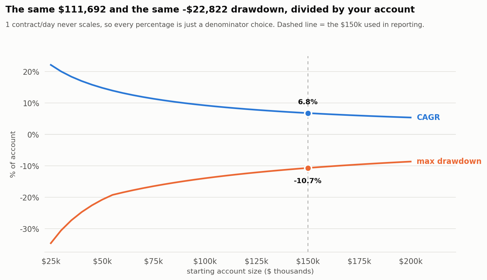

# Bull Put Spread — Daily Cadence

Sell one 21-DTE SPY bull put spread every trading day. One contract, always.

## Parameters

| | |
|---|---|
| Underlying | SPY |
| DTE target | 21 |
| Short leg | **0.35 delta** |
| Long leg | **$10 below the short** (fixed width) |
| Profit target | 80% of max credit |
| Stop loss | 30% of max loss (≈ a 2× credit stop) |
| Exit floor | 5 DTE |
| Size | 1 contract per day |

## Per trade

| Credit | ~$223 |
|---|---|
| Max loss | ~$777 |
| Avg win / avg loss | $183 / −$308 |
| **Expected value** | **+$53** |

## Results — 2018–2026 (8.5 years, 2,125 trades)

Fixed in dollars, **independent of account size**:

| Total P&L | **+$111,692** (~$13,100/yr) |
|---|---|
| Max drawdown | **−$22,822** |
| Win rate | 73.7% |
| Profit factor | 1.66 |

Reported at $150k: **CAGR 6.8% · Max DD −10.7% · Sharpe 0.84** (excess, 2% rf).

## Account size sets every percentage

| Account | CAGR | Max DD | Sharpe |
|---|---|---|---|
| $25k | 22.1% | −34.6% | 0.99 |
| $50k | 14.8% | −20.8% | 0.99 |
| $100k | 9.2% | −14.0% | 0.93 |
| **$150k** | **6.8%** | **−10.7%** | **0.84** |
| $200k | 5.4% | −8.7% | 0.75 |

Position size never scales with the account, so the dollar P&L and dollar drawdown above never
change — only what you divide them by. Pick the account size whose drawdown you can sit through,
not the one with the best CAGR.

## The 2022 drawdown

The entire −$22,822 is one stretch: **3 Jan 2022 → 12 Oct 2022**, then 337 more days to recover —
about 20 months underwater.

It was a grind, not a blow-up. 192 trades closed inside that window at a **43.2% win rate** (vs
73.7% overall). The worst single trade was **−$607** — nothing ever came close to its $777 max
loss. What did the damage was **109 small losses averaging −$325**, and the stop fired on 51.6% of
them, working exactly as designed. Selling puts every day into a year-long downtrend just means
getting stopped out over and over.

2022 is the **only** losing year in the span (−$17,951). 2020 was **+$13,579** — a fast crash that
snaps back is survivable; a slow bleed is what hurts.

## Before trading this

- **DSR 0.002.** The parameter *rankings* are evidence; the absolute Sharpe is not.
- **Synthetic data** (calibrated to real quotes). **No rolling or adjustment logic is modeled** —
  every trade exits at the target, the stop, or the DTE floor.
- **0.35 delta was the top of the search range.** Higher was never tested.

Full analysis and reasoning: [DAILY_CADENCE_STRATEGY.md](DAILY_CADENCE_STRATEGY.md)
