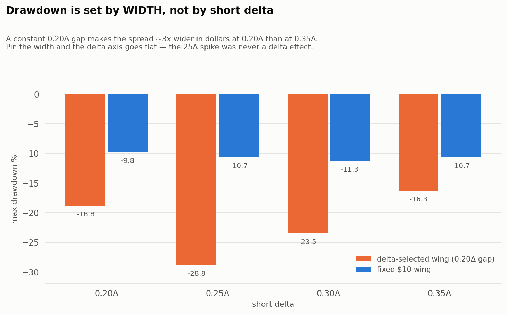
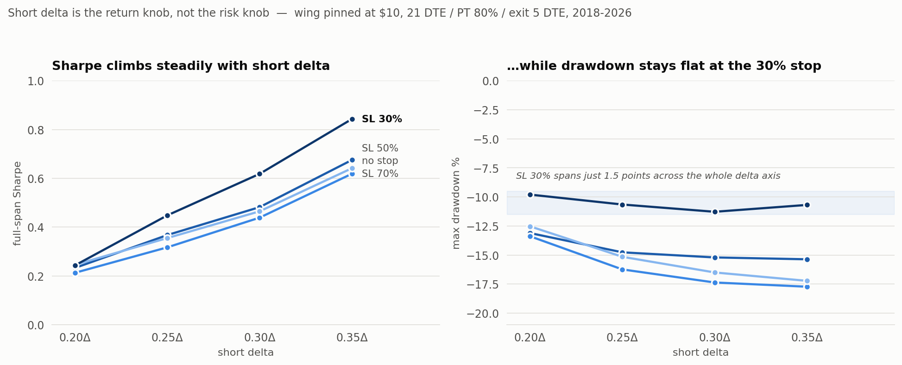
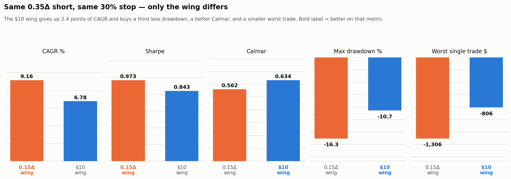

# Daily-Cadence Bull Put Spread: Recommended Parameters

**Status (2026-08-13): the CURRENT recommendation is
[21 DTE / 0.35Δ short / $10 fixed wing / PT 80% / SL 30% / exit 5 DTE](#current-recommendation-2026-08-13).**
The 2026-08-11 section below it is retained because its pricing/grid fixes and its
IS/OOS/regime results still stand — only the **wing choice** changed (0.15Δ delta-selected → $10
fixed), on the strength of a controlled sweep that the original Optuna search could not have
produced. **DSR is still weak (0.002)** — this remains the best-supported relative candidate, not
a statistically validated edge. See [Caveats](#caveats-2026-08-13) first.

---

# Current recommendation (2026-08-13)

| Parameter | Value | Changed from 2026-08-11? |
|---|---|---|
| DTE target | 21 | no |
| Short delta | **0.35** | no |
| Wing | **$10 fixed width** | **YES** — was 0.15Δ delta-selected |
| Profit target | 80% of max credit | no |
| Stop loss | 30% **of max loss** (≈ a 2× credit stop — see below) | no |
| Exit DTE floor | 5 | no |
| Sizing | 1 contract/day, `fixed_contracts` | no |

**Full-span 2018-2026, $150k, 1 contract/day:** CAGR 6.78% · Sharpe 0.843 · Calmar 0.634 ·
max DD **-10.69%** · OOS Sharpe 1.662 · stress Sharpe 0.847 · win rate 73.7% · profit factor 1.66 ·
2,125 trades · worst single trade -$806.

## Why this changed: the question the Optuna search could not answer

The 2026-08-11 recommendation came from a 150-trial Optuna (TPE) search. TPE **concentrates** its
samples in whatever region looks good early, which makes its trial log useless as a parameter
surface: 58 of 127 trials landed on `short_delta=0.35` — which was also the search's hard CEILING
(`optimize_daily_cadence.py:148`, `min=0.15, max=0.35`) — while 0.15-0.25Δ drew 2-5 trials each,
every one carrying a *random* companion set of profit-target/exit-DTE values. So "low delta scores
badly" in that log is confounded with "low delta was only ever tried alongside bad exit params."

`compare_delta_stop_grid.py` replaces that with a **full factorial**: short delta × stop loss, every
other parameter pinned at the winner. Run twice — once with the wing at a constant 0.20Δ gap
(`compare_delta_stop_grid.csv`), once with the wing pinned at $10 (`--width 10`,
`compare_delta_stop_grid_w10.csv`).

## Finding 1 — `stop_loss` is a fraction of MAX LOSS, not of credit

`vertical_spreads.py:301` triggers on `(-profit) / max_loss >= stop_loss`, where
`max_loss = strike_width - credit`. This is the single most misread parameter in the project.
Translated into the units traders actually use (measured on real entries):

| Config `stop_loss` | @ 0.35Δ / $10 wing (credit = 22.3% of width) | @ 0.20Δ / $10 wing (credit = 10.7% of width) |
|---|---|---|
| **0.30** | loss = 104% of credit → spread at **~2.0× entry credit** | loss = 251% of credit |
| 0.50 | loss = 174% of credit | loss = 418% of credit |
| 0.70 | loss = 243% of credit | loss = 585% of credit |

So the recommended "SL 30%" is a **conventional ~2× credit stop**, not a hair trigger — and the
*same* config number means something very different at a different delta. Always translate before
reasoning about it.

At these settings the stop is a live control, not a formality: it takes **23.0%** of trades at
0.35Δ/SL 30% (vs 14.4% at SL 50%, 8.5% at SL 70%). An earlier `dte_min=22` configuration made the
stop look nearly inert (0.4% of trades) purely because the DTE floor closed everything first.

## Finding 2 — drawdown is set by WIDTH, not by short delta



The delta-gap grid appears to show low delta causing deep drawdowns — 25Δ at **-28.8%**. That is an
artifact of how the wing was defined. Holding a constant 0.20Δ gap means the spread gets *wider in
dollars* as short delta falls (credit is 6.3% of width at 0.20Δ/0.03Δ but 20.4% at 0.35Δ/0.15Δ), so
the "low delta" leg of that test was also silently a much larger position. Pin the dollar width and
the delta axis goes flat: **-9.8% / -10.7% / -11.3% / -10.7%** across 0.20→0.35Δ.

**Short delta is the probability knob; width is the risk knob.** Do not conflate them.

## Finding 3 — at constant width, 0.35Δ and SL 30% win on every cut



Full factorial at a fixed $10 wing, all else at 21 DTE / PT 80% / exit 5 DTE:

| Short Δ | CAGR | Sharpe | OOS Sharpe | Stress Sharpe | Max DD | Win rate | Worst trade |
|---|---|---|---|---|---|---|---|
| 0.20 | 3.09% | 0.243 | 0.861 | 0.465 | -9.8% | 80.8% | -$1,009 |
| 0.25 | 4.30% | 0.448 | 1.207 | 0.629 | -10.7% | 78.5% | -$862 |
| 0.30 | 5.46% | 0.618 | 1.464 | 0.721 | -11.3% | 75.9% | -$956 |
| **0.35** | **6.78%** | **0.843** | **1.662** | **0.847** | -10.7% | 73.7% | **-$806** |

Sharpe rises **monotonically** with short delta — full-span, OOS, stress and calm alike — while
drawdown does not move. 0.35Δ also produces the *smallest* worst single trade in the grid, because
its larger credit (22.3% of width) is a thicker cushion and the stop fires earlier against it.
Stepping down to 0.25Δ costs ~2.5 points of CAGR and buys **zero** drawdown reduction.

Stop loss, same grid — SL 30% is best at every delta on full-span Sharpe, stress Sharpe, CAGR
**and** drawdown:

| Short Δ | SL 30% | SL 50% | SL 70% | no stop |
|---|---|---|---|---|
| Sharpe @ 0.35Δ | **0.843** | 0.675 | 0.619 | 0.641 |
| Max DD @ 0.35Δ | **-10.7%** | -15.4% | -17.7% | -17.2% |

Loosening the stop costs 5-7 drawdown points and buys nothing except at 0.20-0.25Δ, where looser
stops do help OOS (0.861 → 1.129 at 0.20Δ). At 0.35Δ the tight stop wins OOS too.

## Finding 4 — the $10 fixed wing beats the delta-selected wing on risk-adjusted terms



| Metric | 0.15Δ wing | **$10 fixed wing** |
|---|---|---|
| CAGR | **9.16%** | 6.78% |
| Sharpe | **0.973** | 0.843 |
| Calmar | 0.562 | **0.634** |
| Max drawdown | -16.31% | **-10.69%** |
| Worst single trade | -$1,306 | **-$806** |

The delta wing wins raw return and raw Sharpe; the $10 wing wins **Calmar, drawdown and tail**. For
a fixed 1-contract-per-day book where per-trade dollar risk is the binding practical constraint,
that trade is worth taking — you give up 2.4 points of CAGR for a third less drawdown.

There is also a structural argument the metrics above understate: **a delta-selected wing's dollar
width balloons exactly when vol spikes.** The 0.30Δ/0.10Δ delta-gap row recorded a single **-$6,194**
trade — a position whose max loss grew far beyond anything intended, because a fixed 0.20Δ gap spans
a huge dollar distance in a high-vol chain. A fixed $10 wing cannot do this: per-contract risk is
known and identical every day. (That -$6,194 is a *different* short delta than the head-to-head
above — do not read it as a same-config comparison.)

### This reverses the 2026-08-11 verdict on fixed-width wings — here is why that is not a contradiction

The [2026-08-11 section](#alternative-structure--20-fixed-width-wing-corrected-2026-08-11--not-recommended)
rejected fixed-width wings on an OOS-stress Sharpe of **-1.05**. That verdict was about a **$20**
wing at 0.31Δ, chosen by a search that **pinned to the top of its own $5-$20 range** — a caution flag
the section itself raised. It was never a test of a $10 wing at 0.35Δ, which posts a stress Sharpe of
**+0.847**. Both results stand; they are different structures.

## Caveats (2026-08-13)

1. **DSR = 0.002 (weak).** Unchanged, and consistent with every search in this project's history.
   The *monotonic ranking across five independent metrics* is the evidence here; the absolute
   Sharpe magnitudes are not. Do not size off these numbers as if they were validated.
2. **0.35Δ was the search ceiling and every trend points upward.** Nothing here establishes that
   0.35 beats 0.40 or 0.45 — only that it beats everything below it. The range was never widened.
3. **No rolling or adjustment logic exists anywhere in the strategy code.** Every trade exits at
   the profit target, the stop, or the DTE floor. A discretionary trader who rolls tested positions
   is running a materially different strategy — and this is the most plausible remaining
   explanation for the standing tension with live 20Δ experience (see 2026-08-11 caveat 4).
4. **Synthetic data.** Real-quote-grounded (skew/friction/vol refit against real chains) but still
   synthetic. Stop-loss and profit-target behavior have never been confirmed against real fills.
5. **The stop-loss regime split is real and unresolved.** SL 30%'s advantage is concentrated in
   stress periods; in the calm 2024-2026 OOS window a looser stop scores slightly better at every
   delta. The recommendation weights full-span and stress performance over the recent calm slice.
6. **GFC (2008-2009) has still not been re-tested on the corrected grid** (2026-08-11 caveat 7),
   and this sweep did not change that.
7. **Full-span and IS/OOS Sharpe use DIFFERENT conventions — do not cross-compare them.**
   Full-span Sharpe comes from `metrics.py:84`, which subtracts a 2% risk-free rate (excess
   Sharpe). The IS/OOS slice Sharpes in this document are raw (no rf). At $150k the gap is ~0.36,
   so "OOS 1.662 vs full-span 0.843" overstates OOS strength by roughly that much. Rankings
   *within* either column are unaffected — every row uses the same formula as every other row —
   but the two columns are not on the same scale.
8. **Percentage metrics are a denominator choice, not a property of the strategy.** Under
   `fixed_contracts` sizing the account never gates entries, so dollar P&L (+$111,692) and dollar
   drawdown (-$22,822) are identical at any starting capital; only CAGR/DD%/Sharpe move. See
   [DAILY_CADENCE_CARD.md](DAILY_CADENCE_CARD.md) for the account-size table, and note that excess
   Sharpe *falls* as capital rises (0.99 at $25k → 0.75 at $200k) because the risk-free drag grows
   as percentage volatility shrinks.

## Reproduce (2026-08-13)

```
opt_venv/bin/python compare_delta_stop_grid.py             # delta-selected wing (0.20Δ gap)
opt_venv/bin/python compare_delta_stop_grid.py --width 10  # fixed $10 wing
opt_venv/bin/python make_delta_width_charts.py             # the three charts above
opt_venv/bin/python diag_capital_denominator.py            # same trades, 3 capital bases
opt_venv/bin/python diag_drawdown_anatomy.py               # the 2022 drawdown window
opt_venv/bin/python make_account_size_chart.py             # account-size sweep + chart
```

Results: `backtest_results/compare_delta_stop_grid.csv`, `backtest_results/compare_delta_stop_grid_w10.csv`,
`account_size_sweep.csv`, `diag_capital_denominator.csv`.

---

# [Prior recommendation — 2026-08-11] Pricing/grid fixes and the delta-wing search

Everything in this section stands **except the wing choice**, which is superseded above. The
skew-tail and strike-grid fixes, the IS/OOS/regime methodology, and the delta-wing metrics remain
the reference record for how the corrected dataset was built.

## What changed and why (2026-08-11)

You raised two concerns about the original report: the SPY chain's strike gaps were too coarse to
hit a precise delta, and the training data might be too benign (too little GFC/COVID) to find a
robust delta/width. Investigating both surfaced a **third, bigger problem that subsumed them**:

1. **The IV surface's skew was extrapolated unbounded past where it was actually fitted.**
   `skew_calibration.py` fits the put/call skew quadratics only over `m` (log-moneyness) in
   `[-0.20, 0]` / `[0, 0.06]` — real quotes don't reliably exist further out. Outside that band the
   old code let the quadratic itself keep running, and its curvature (19.51/20.0) blows up: skew
   hit **11x** by `m=-0.67` on a low-spot day. Measured on the actual dataset, **17-50% of the
   2018-2023 (IS) search space priced on this extrapolation per year**, worst in exactly the
   volatile years (2018, 2020) that dominate the IS side of the walk-forward split, vs. ~0-1% in
   the 2024-2026 OOS window. This inflated the cost of the protective (long) leg specifically
   during stress, biasing every prior search against wide/low-delta structures.
2. **The strike grid was a fixed $5/±$100 band.** That's ±45% of spot when SPY was $218 (2020) and
   only ±13% when SPY is $745 (2026) — so a 0.10-0.20Δ long wing was **literally unreachable** on
   crisis days (verified: 2020-03-23's minimum available |delta| on a 20-45 DTE put was 0.105).

Both are now fixed. Because the mispricing was concentrated in the volatile years, and because
GFC-era pricing has no real quotes to validate against, the fix order was: **fix the pricing and
grid first, re-optimize on the (still 2018-2026, real-quote-grounded) window second** — not widen
training into unvalidated eras. See [Methodology](#methodology-2026-08-11) for the mechanism.

### What the fix actually changed (diagnostic: old published params, re-run on corrected data)

Full 2018-2026 span, $150k, 1 contract/day. Achieved-delta accuracy went from "off target on a
quarter of trades" to **exact**:

| Structure (unchanged params) | Old Sharpe | New Sharpe | Old %% off-target delta | New %% off-target |
|---|---|---|---|---|
| 24 DTE / 0.35Δ / 0.19Δ | 0.80 | **0.916** | 25.0% (46% in GFC) | **0.0%** |
| 24 DTE / 0.31Δ / $10 wide | n/a (not computed) | 0.695 | n/a | 0.0% |
| 24 DTE / 0.20Δ / 0.10Δ | every ~20Δ combo tested negative (worst -3.55) | **0.410** | — | 0.0% |
| 24 DTE / 0.20Δ / $5 wide | (untested) | -0.051 | — | 0.0% |
| 24 DTE / 0.20Δ / $10 wide | (untested) | **0.291** | — | 0.0% |

This directly narrows the standing tension in the old report (caveat 4 below): live trading
reportedly showed 20Δ outperforming 30Δ, while the old backtest showed every 20Δ combination
losing badly. Under corrected pricing, 20Δ structures are solidly positive — not yet beating
30-35Δ on pooled Sharpe in this exact ($150k, 1-contract/day) model, but no longer contradicting
live experience either. Notably, the *regime* breakdown shows 20Δ structures score **better in
stress than in calm** (e.g. 20Δ/10Δ: 0.42 calm vs 0.56 stress), while the 35Δ winner is roughly
flat across regimes — consistent with a genuine risk/reward tradeoff (wider protection matters
less until a crash hits, then it pays off), not a modeling artifact.

## Delta-selected wing (was primary on 2026-08-11; wing superseded 2026-08-13)

> **Superseded:** the 0.35Δ short / PT 80% / SL 30% / 21 DTE / exit-5-DTE core below is still the
> recommendation. The **0.15Δ wing is not** — see
> [Finding 4](#finding-4--the-10-fixed-wing-beats-the-delta-selected-wing-on-risk-adjusted-terms). Metrics in
> this section are for the 0.15Δ wing and remain accurate for it.


Re-optimized on the corrected data (150-trial Optuna, both wing types, resumable SQLite storage).

| Parameter | Old (superseded) | **New** |
|---|---|---|
| DTE target | 24 | **21** |
| Short delta | 0.35 | 0.35 |
| Long delta | 0.19 | **0.15** |
| Profit target | 90% | **80%** |
| Stop loss | 30% | 30% |
| Exit DTE floor | 5 | 5 |

The corrected pricing pulled the protective leg wider (0.19Δ → 0.15Δ) — exactly the direction the
diagnostic above says the old pricing was penalizing — and shortened the DTE target and profit
target. Short delta and stop loss were unchanged by the re-search.

### In-sample (2018-01-02 → 2023-12-19, embargoed — see Methodology)

| Sharpe | Total return | Max DD | Win rate | Trades |
|---|---|---|---|---|
| 0.741 | 53.26% | -16.77% | 73.30% | 1,401 |

### Out-of-sample (2023-12-20 → 2026-07-09) — the honest test

| Sharpe | Return | Trades | Verdict |
|---|---|---|---|
| **1.267** | 31.18% | 622 | healthy — edge survives OOS (OOS Sharpe exceeds IS, by a wide margin) |

### Regime-conditional breakdown (calm vs. stress, never blended into the numbers above)

| | Sharpe | Max DD | Trades | Win rate |
|---|---|---|---|---|
| IS calm | 0.721 | -16.34% | 1,140 | 79.6% |
| IS stress | 0.564 | -16.77% | 261 | 46.0% |
| OOS calm | 1.410 | -6.13% | 592 | 75.0% |
| OOS stress | **0.542** | -5.37% | 30 | 83.3% |
| **Worst-regime OOS Sharpe** (robust-ranking criterion) | **0.542** | | | |

OOS stress trades are thin (30) — the April 2025 tariff-shock selloff dominates that slice — so
trust the direction more than the exact magnitude.

### Full-span (2018-2026, combined, $150k, fixed 1 contract/day)

| Metric | Old (superseded) | **New** |
|---|---|---|
| Trades | 1,875 | 2,092 |
| CAGR | 7.60% | **9.16%** |
| Total return | 86.20% | **110.50%** |
| Sharpe / Sortino / Calmar | 0.80 / 0.86 / 0.54 | **0.973 / 1.008 / 0.562** |
| Max drawdown | -14.14% | -16.31% (deeper — see caveats) |
| Win rate / Profit factor | 73.9% / 1.71 | 74.81% / 1.744 |
| Avg win / Avg loss | $227.17 / -$375.67 | $251.12 / -$427.56 |
| Largest win / Largest loss | $578.82 / -$1,890.24 | $657.28 / -$1,305.60 |
| Avg days in trade | 15.47 | 15.87 |
| Positive months | 69.6% (best +5.48%, worst -6.20%) | 66.7% (best +4.80%, worst -5.23%) |
| Full-span calm / stress Sharpe | not measured | **0.958 / 0.914** |

Every headline metric improved except max drawdown, which is deeper by ~2 points — a real,
honest tradeoff, not noise: the corrected pricing collects less inflated premium on the protective
leg specifically during stress, so drawdowns during actual stress periods are somewhat larger even
as risk-adjusted (Sharpe) and total returns both improved. Full-span calm and stress Sharpe are
close (0.96 vs 0.91) — this structure holds up consistently across regimes over the FULL span, even
though the OOS-only stress slice above (0.542) is meaningfully lower than OOS calm (1.410); the
gap is concentrated in the small, recent OOS stress sample, not a full-history pattern.

### Deflated Sharpe (overfitting / selection check)

Best Sharpe 0.74 vs. the no-skill selection benchmark 1.92 (expected best of 130 valid trials
under zero true skill). **DSR = 0.002 (WEAK)** — does not clear the >0.95 significance bar. Same
as every search in this project's history; trust the relative ranking, not the absolute Sharpe.

## Alternative structure — **$20** fixed-width wing (corrected 2026-08-11) — NOT recommended

> **Scope note (2026-08-13):** this section rejects a **$20** wing at 0.31Δ, not fixed-width wings
> in general. A **$10** wing at 0.35Δ posts a stress Sharpe of +0.847 and is now the recommended
> structure. The two results do not conflict — see
> [why that is not a contradiction](#this-reverses-the-2026-08-11-verdict-on-fixed-width-wings--here-is-why-that-is-not-a-contradiction).


| Parameter | Old (superseded) | New |
|---|---|---|
| DTE target | 24 | 24 |
| Short delta | 0.31 | 0.31 |
| Wing width | $10 (fixed) | **$20 (fixed)** |
| Profit target | 90% | 80% |
| Stop loss | 30% | 30% |
| Exit DTE floor | 5 | 5 |

| Window | Sharpe | Return | Max DD | Trades |
|---|---|---|---|---|
| IS (2018-23) | 0.662 | 51.57% | -17.07% | 1,285 |
| OOS (2023-26) | 1.033 | 27.17% | — | 620 |
| OOS calm | 1.105 | — | -7.44% | 590 |
| **OOS stress** | **-1.051** | — | -5.67% | 30 |
| Full-span (2018-2026) | 0.812 | 99.80% | -16.96% | 1,990 |
| Full-span calm / stress | 0.761 / 0.833 | | | |

**Why this is not recommended despite a competitive pooled OOS Sharpe:** its OOS-stress Sharpe is
deeply negative (-1.051) — the April 2025 tariff-shock slice specifically — while the delta wing
stays solidly positive (0.542) in the identical window. The full-span stress number (0.833) looks
fine in isolation, so this is specifically an OOS (recent, honest, un-fit) result, not a
whole-history pattern — but OOS is the test that matters for "would this have worked recently."
The search also hit the EDGE of the tested width range ($20 was the maximum allowed) — the
optimizer wants to go even wider, which is itself a caution flag: a fixed-dollar wing that wide is
a large, static bet whose protection doesn't reposition as the market moves, plausibly why it's
fragile in a fast selloff. DSR is also the weakest of any structure tested (0.000).

## Head-to-head: delta wing vs. width wing (both re-optimized on corrected data)

| Metric | Delta wing (new) | Width wing (new) |
|---|---|---|
| IS Sharpe | **0.741** | 0.662 |
| OOS Sharpe (pooled) | **1.267** | 1.033 |
| OOS calm Sharpe | **1.410** | 1.105 |
| OOS stress Sharpe | **0.542** | -1.051 |
| Full-span Sharpe | **0.973** | 0.812 |
| Full-span CAGR | **9.16%** | 8.50% |
| Full-span calm / stress Sharpe | 0.958 / **0.914** | 0.761 / 0.833 |
| DSR | 0.002 (weak) | 0.000 (weaker) |

Delta wing is equal-or-better on every single cut **against the $20 width wing this table
compares it to**. That was the 2026-08-11 recommendation.

> **Superseded 2026-08-13.** Both columns above came from Optuna searches that pinned to their own
> range edges (short delta at its 0.35 ceiling; width at its $20 ceiling). A controlled factorial
> at a **$10** width — never searched here — beats the delta wing on Calmar, drawdown and worst
> trade. Current recommendation: [$10 fixed wing](#current-recommendation-2026-08-13).

## Methodology (2026-08-11)

- **Skew-tail fix**: `synthetic_generator.py::_iv_surface` now continues LINEARLY at the fitted
  quadratic's own slope at the knot (`m=-0.20` puts, `m=+0.06` calls) instead of letting the
  quadratic itself run unbounded past it — continuous in value and first derivative, no runaway
  acceleration past the point real quotes support. Knots are sourced directly from
  `skew_calibration.py`'s `PUT_M_MIN`/`CALL_M_MAX` so the fit range and extrapolation boundary can
  never drift apart.
- **Grid fix**: `synthetic_generator.py::generate_delta_band_strikes` — $1 spacing (matching real
  SPY) across a vol-adaptive band computed per (day, expiration) to span |Δ| in [0.02, 0.60], plus
  a coarse $5 outer tail for marking positions that move deep ITM/OTM after entry. Replaces the
  fixed $5/±$100 grid. Dataset: `data/processed/SPY_synthetic_options_2018-01-01_2026-07-10_db1.csv`
  (9.97M rows, ~4.4x the old file — grid mode is encoded in the filename so it can never silently
  collide with the old coarse-grid file). Config: `synthetic_data.grid_mode: delta_band` (project
  default unchanged at `fixed` — every other optimizer still uses the original grid).
- **Performance fix**: `optopsy_wrapper.py` now memoizes `prepare_optopsy_data` and a
  quote-date grouping by IDENTITY of the input DataFrame, so a 200+ trial Optuna search doesn't
  re-copy and re-process the entire multi-year dataset from scratch on every trial. Verified as a
  pure no-op: identical Sharpe/trades/return/maxDD across repeated trials on the same data.
- **Purge/embargo**: no new IS entries in the final 40 trading days of the IS window
  (`optimize_daily_cadence.py::EMBARGO_TRADING_DAYS`), so no IS-scored trade is force-closed at the
  window boundary before its own exit condition could fire. Sized to the search space's worst-case
  trade duration (dte up to 45 ±5 tolerance, held to a dte_min exit as low as 5).
  Exits still fire normally past the cutoff — only new entries are blocked.
  OOS scoring doesn't need this (`walk_forward.evaluate_oos_continuous` runs one continuous
  backtest across the full span and slices the equity curve, so positions flow naturally across
  the boundary).
- **Regime-conditional reporting**: `src/analysis/regime.py` tags calm vs. stress trading days
  (2018 Q4 selloff, COVID crash, 2022 bear, plus the Aug-2024 yen-carry spike and Apr-2025
  tariff-shock selloff that fall inside the OOS window) and reports Sharpe/max DD/win rate as
  SEPARATE columns — never blended into pooled Sharpe. This is a reporting split, not a resampling
  of the training data: the window's ~13.5% stress share is close to the historical base rate
  (~15% NBER recession months), so reweighting toward stress would have biased the unconditional
  estimate and collapsed effective sample size (COVID alone is 35 trading days).
- **Search re-run**: 150-trial Optuna (TPE) per wing type on the corrected dataset, resumable
  SQLite storage separately suffixed from the old (broken-pricing) studies so they can never be
  mixed. `long_delta` search floor widened 0.05→0.03 (now actually reachable). Reproduce:
  `optimize_daily_cadence.py` / `optimize_daily_cadence.py --width` (both default to the corrected
  grid; pass `--legacy-grid` to reproduce the old coarse-grid results for comparison).

## Caveats (2026-08-11)

1. **DSR is weak on both searches (0.002 / 0.000).** Consistent with every optimizer run in this
   project — nothing has ever cleared the significance bar. Trust the relative ranking (delta wing
   over width wing, this delta region over others), not the absolute Sharpe number.
2. **~~$5 synthetic strike grid~~ RESOLVED.** Achieved delta now matches target exactly (0.0% of
   trades >0.03 off target, down from 25% normally / 46% in the GFC under the old grid).
3. **This does not replace the earlier pooled-risk-budget recommendation** (0.24-0.30Δ short /
   0.10Δ long, 22 DTE exit, PT 60% / SL 50%, 15% risk budget) — different capital-allocation model
   (position size scales with account value, one shared risk pool). Don't mix sizing models.
4. **~~Unresolved tension: live 20Δ vs. backtest~~ SUBSTANTIALLY NARROWED, not fully closed.** The
   old backtest showed every ~20Δ combination losing; corrected pricing shows all three tested
   solidly-to-modestly positive (0.29-0.41 Sharpe), and specifically better-in-stress-than-calm.
   Still trails 30-35Δ on pooled Sharpe in this exact model — the remaining gap may reflect a real
   risk/reward tradeoff, a difference between this fixed-$150k/1-contract model and how you
   actually size/manage the live book, or residual pricing imprecision. Not fully reconciled.
5. **Stop-loss (30%) and profit target (80%) were discovered by the search**, not confirmed against
   actual live trade history — worth validating against real fills before trusting them.
6. **No account-size sizing has been re-derived for this model.** Everything above assumes exactly
   1 fixed contract regardless of account value.
7. **GFC (2008-2009) was not re-tested on the corrected grid.** The GFC-era file
   (`SPY_synthetic_options_2008-01-01_2009-12-31.csv`) only exists at the old $5 grid; regenerating
   it at $1/delta-band resolution was not done in this pass (cost/time tradeoff — flagged as a gap,
   not attempted). The old GFC stress-test numbers for the SUPERSEDED parameters (below) used
   pre-fix pricing and should not be treated as validated for the new parameters.
8. **Max drawdown is deeper on the corrected data** (-16.31% vs -14.14% full-span) despite every
   return/Sharpe metric improving — see the full-span table note above. This is a real, expected
   consequence of the fix (less inflated premium collected on the protective leg during stress),
   not a regression to be alarmed by, but it changes the risk profile the old number implied.
9. **OOS-stress sample is thin** (30 trades, dominated by one event — the April 2025 tariff shock).
   The delta-vs-width gap there (0.542 vs -1.051) is directionally meaningful but should not be
   read as a precise, low-variance estimate.

## Source data

- `data/processed/SPY_synthetic_options_2018-01-01_2026-07-10_db1.csv` (corrected: bounded skew
  tail + $1 delta-band grid, 9.97M rows)
- `optimization_results/BullPutSpreadDailyCadence_20260811_190336.csv` (delta wing, 134 valid
  trials, corrected data)
- `optimization_results/BullPutSpreadDailyCadenceWidth_20260811_193243.csv` (width wing, 150
  trials, corrected data)
- `optimize_daily_cadence.py`, `diag_corrected_winners.py`, `diag_new_winners_fullspan.py`,
  `src/analysis/regime.py`

---

# [SUPERSEDED 2026-08-11] Original 2026-08-10/11 report

Preserved below for reference. Every number in this section was computed on the pre-fix pricing
(unbounded skew-tail extrapolation) and the old fixed $5/±$100 strike grid — see the correction
above for what changed and why. Do not use these parameters or metrics going forward.

**Status:** Best candidate from the 2026-08-10/11 daily-cadence search. **DSR is weak on both
searches below — this is the best-supported relative candidate found, not a statistically
validated edge.** See [Caveats](#caveats) before trading this.

## Methodology

Every earlier parameter search in this project sized positions off a shared risk-budget pool
(`max_risk_percent` of current equity), which throttles entries to 2-4 concurrent positions. That
does not match how this is actually traded: **one new spread every eligible trading day, fixed
size (1 contract), independent of what else is open**, picking the expiration closest to a DTE
target and closing at a DTE floor or profit target — a cost-averaging approach that naturally
handles delta drift and changing SPY prices day to day.

- **Sizing:** `position_sizing.method: fixed_contracts`, `contracts_per_trade: 1` (config/config.yaml)
- **Data window:** 2018-01-02 to 2026-07-09 (the only real-quote-grounded pricing in this project)
- **Walk-forward split:** IS 2018-01-02 → 2023-12-19 (70%) / OOS 2023-12-20 → 2026-07-09 (30%)
- **Search:** two independent 250-trial Optuna (TPE) runs, one per wing type — `strike_width`
  takes precedence over `long_delta` in the entry logic, so the two can't be searched jointly
- **Search space:** `dte` (target) 21-45, `short_delta` 0.15-0.35, `long_delta` 0.05-0.33 (delta
  wing) or `strike_width` $5-$20 (fixed wing), `profit_target` 0.20-0.90, `stop_loss` 0.10-0.90,
  `dte_min` (exit) 5-25
- Reproduce: `optimize_daily_cadence.py` (delta wing) / `optimize_daily_cadence.py --width`
  (fixed wing); full metrics + GFC diagnostic: `diag_winner_full.py`

## Recommended structure — delta-selected wing (primary)

| Parameter | Value |
|---|---|
| DTE target | 24 |
| Short delta | 0.35 |
| Long delta | 0.19 |
| Profit target | 90% of max credit |
| Stop loss | 30% of max loss |
| Exit DTE floor | 5 |
| VIX filter | none (proven inert on this window — see prior findings) |

### In-sample (2018-01-02 → 2023-12-19)

| Sharpe | Total return | Max DD | Win rate | Trades |
|---|---|---|---|---|
| 0.702 | 46.06% | -14.33% | 73.46% | 1,217 |

### Out-of-sample (2023-12-20 → 2026-07-09) — the honest test

| Sharpe | Return | Trades | Verdict |
|---|---|---|---|
| **1.145** | 27.52% | 611 | healthy — edge survives OOS (OOS Sharpe exceeds IS) |

### Full-span (2018-2026, combined, $150k, fixed 1 contract/day)

| Metric | Value |
|---|---|
| Trades | 1,875 |
| CAGR | 7.60% |
| Total return | 86.20% |
| Sharpe / Sortino / Calmar | 0.80 / 0.86 / 0.54 |
| Max drawdown | -14.14% |
| Win rate / Profit factor | 73.9% / 1.71 |
| Avg win / Avg loss | $227.17 / -$375.67 |
| Largest win / Largest loss | $578.82 / -$1,890.24 |
| Avg days in trade | 15.47 |
| Positive months | 69.6% (best +5.48%, worst -6.20%) |

### GFC stress test (2008-2009)

| Metric | Value |
|---|---|
| Trades | 109 |
| CAGR | -0.53% |
| Total return | -1.06% |
| Sharpe / Sortino | -2.33 / -1.87 |
| Max drawdown | **-3.60%** |
| Win rate / Profit factor | 70.6% / 0.76 |
| Avg win / Avg loss | $59.12 / -$187.51 |
| Largest loss | -$523.97 |

Net-negative across a 2-year crash window is expected; the drawdown staying this contained
(-3.6%) is the notable result — smaller than nearly every other structure tested in this project.
**Computed on the pre-fix pricing model — not re-validated on corrected pricing (Caveat 7 above).**

### Achieved delta vs. target (data-fidelity check) — RESOLVED, see correction above

The synthetic dataset uses a **$5 strike grid**, not real SPY's $1 increments. Near 0.30-0.40Δ a
single $5 strike step can shift delta by 5-10 points — coarser than the 0.05 matching tolerance
itself on some days.

| | Full 2018-2026 | GFC 2008-2009 |
|---|---|---|
| Achieved short delta: median / std | 0.349 / 0.024 | 0.354 / 0.030 |
| Achieved short delta: range | 0.30 – 0.40 | 0.30 – 0.40 |
| % of trades >0.03 off the 0.35 target | 25.0% | 45.9% |
| % of long-leg trades >0.03 off the 0.19 target | 7.5% | 32.1% |

Treat "0.35Δ" as "approximately 0.30-0.40Δ," not a precise point — fine distinctions between
adjacent delta values in the search (0.33 vs 0.35 vs 0.37) are likely grid noise, not signal. The
gap widens in high volatility (GFC), exactly when it matters most.

### Deflated Sharpe (overfitting / selection check)

Best Sharpe 0.70 vs. the no-skill selection benchmark 2.05 (expected best of 222 valid trials
under zero true skill). **DSR = 0.000 (WEAK)** — this does not clear the >0.95 significance bar.

## Alternative structure — fixed-width wing

| Parameter | Value |
|---|---|
| DTE target | 24 |
| Short delta | 0.31 |
| Wing width | $10 (fixed, anchored to the short strike) |
| Profit target | 90% |
| Stop loss | 30% |
| Exit DTE floor | 5 |

| Window | Sharpe | Return | Max DD | Win rate | Trades |
|---|---|---|---|---|---|
| IS (2018-23) | 0.728 | 40.62% | -11.29% | 77.06% | 1,251 |
| OOS (2023-26) | 0.982 | 19.10% | — | — | 618 |

OOS verdict: degraded, not collapsed (edge persists but weaker — 0.982 falls just under the 1.0
bar this project uses for "healthy"). DSR = 0.000 (WEAK) — best Sharpe 0.73 vs. benchmark 2.35
(246 trials). Full-span and GFC metrics were not computed for this variant before the correction.

## Convergence note

Both searches — independent, different wing types — landed on nearly identical DTE target (24),
profit target (90%), stop loss (30%), and exit floor (5 DTE). That agreement, arrived at
separately, is the strongest cross-validation signal in this result. Short delta differs modestly
(0.35 vs 0.31) but both sit well above the 0.20-0.30Δ region the earlier (pooled-risk-budget)
project recommendation used.

## Caveats

1. **DSR is weak on both searches (~0.000).** Consistent with every optimizer run in this
   project — nothing has ever cleared the significance bar. Trust the relative ranking (delta
   region, exit shape), not the absolute Sharpe number.
2. **$5 synthetic strike grid** means achieved deltas miss the target by >0.03 on 25% of trades
   normally, 46% during crises (see above). The precise delta values reported are fuzzier than
   they look. **RESOLVED 2026-08-11 — see correction above.**
3. **This does not replace the earlier pooled-risk-budget recommendation** (0.24-0.30Δ short /
   0.10Δ long, 22 DTE exit, PT 60% / SL 50%, 15% risk budget) — that used a different
   capital-allocation model (position size scales with account value, one shared risk pool) and
   is still the right reference if sizing as a % of account rather than a fixed daily contract
   count. Don't mix the two structures with the wrong sizing model.
4. **Unresolved tension:** live trading reportedly showed 20Δ outperforming 30Δ, but this daily-
   cadence backtest shows every ~20Δ combination losing (negative Sharpe) in both searches. Not
   yet reconciled — see prior discussion. **SUBSTANTIALLY NARROWED 2026-08-11 — see correction
   above.**
5. **Stop-loss (30%) was discovered by the search**, not confirmed against actual live trade
   history — worth validating against real fills before trusting it.
6. **No account-size sizing has been re-derived for this model.** Everything above assumes
   exactly 1 fixed contract regardless of account value — unlike the earlier pooled-budget
   investigation, which explicitly tested $2k/$10k/$20k/$100k tiers.

## Source data

- `optimization_results/BullPutSpreadDailyCadence_20260810_224938.csv` (delta wing, 227 valid trials)
- `optimization_results/BullPutSpreadDailyCadenceWidth_20260810_233913.csv` (width wing, 250 trials)
- `optimize_daily_cadence.py`, `diag_winner_full.py`
